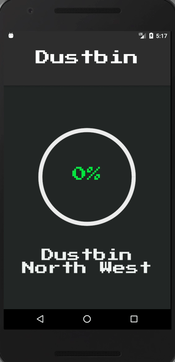

## Smart Dustbin
 ----
> **NOTE** - connected to hardware via firebase

## 🏁 Getting Started

- See [hardware-dustbin](https://github.com/Aniket965/hardware-dustbin)
- add constant.js with this format to root
```js
import firebase from "firebase";
// add config from firebase web project
var config = {
   ...
  };
  firebase.initializeApp(config);
export const IOTref = firebase.database().ref("/IOT");
```
## 📦 install the app


## 🎬 Demo

